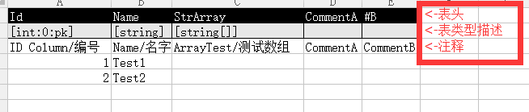
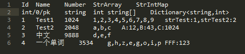
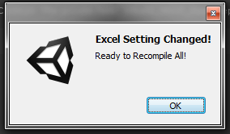
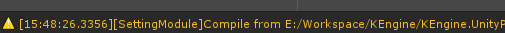
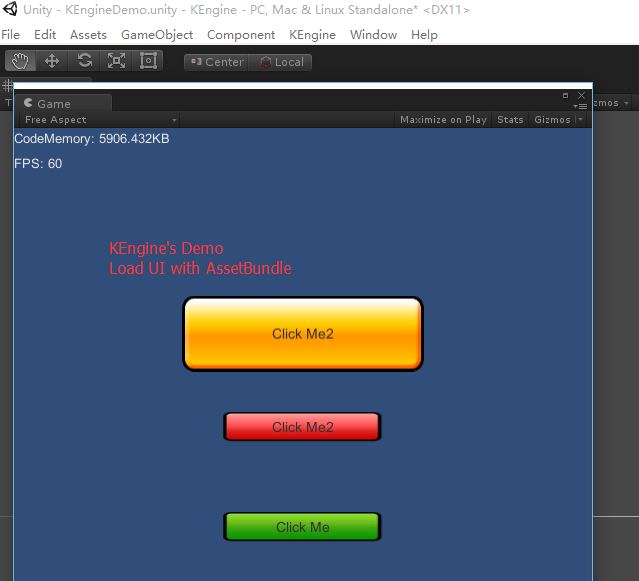

> KEngine现已同时兼容Unity 4和Unity 5。默认资源AssetBundle使用Unity 5进行构建，在使用Unity 4打开工程后，Asset Bundle需要重新再打包。
> 
> Unity 5建议直接使用[**KSFramework**](https://github.com/mr-kelly/KSFramework), 整合KEngine+SLua, 并移除一些Unity 4的支持模块。

# KEngine

KEngine是一个用于Unity3D引擎的AssetBundle框架。

她的核心，资源模块（ResourceModule）为AssetBundle的资源加载、打包提供完整的一套工程规范，减少在项目开发过程中踩坑的时间;
同时基于资源模块，提供了UI模块（UIModule）、配置表模块（SettingModule），实现完整的项目协作工作流。

An **official fork** from CosmosEngine: https://github.com/mr-kelly/CosmosEngine
CosmosEngine的官方改名、改进版

# 特点 / Features

* 代码精简, 运行时没有使用反射机制，高性能
* 适用于PC/Android/IOS平台开发
* 良好扩展性，支持资源的高清版、低清版
* 两种异步风格的AssetBundle加载
* 具备完整的策划->美术->程序工作流
* [美术资源]包含AssetBundle的加载、打包
* [美术资源]编辑器模式下AssetBundle的性能调试器
* [UI界面]基于约定的、无配置式的UI模块
* [策划配置]基于Excel进行编译，配置表可添加图表、注释、批注
* [策划配置]配置表加载支持运行时**热重载**, 无需重启立即生效
* [策划配置]自动生成文档完善的静态代码，大大便捷开发流程

# 整体结构：模块插拔与三大基础模块

KEngine本质上只是一个模块容器(Module Container)，它只为各个模块提供初始化管理。

打个类比，计划开发一个住宅社区，KEngine是一块没有开垦的满是泥巴的地，资源模块(ResourceModule)就是为这块地铺上了水泥；UI模块就是这个社区的会所，配置表模块就是这个社区的物业公司，它们都以水泥地的铺设为前提。接着各式各样的楼房，就是各个不同的自定义模块了。

框架中存在三大基础模块：

* 资源模块 / ResourceModule（基础模块）
* UI模块 / UIModule
* 配置表模块 / SettingsModule

AppEngine.Create函数可以传入继承IModule的类来实现模块添加。所有的IModule统一通过协程来进行初始化的。

-----------------------

# 快速入门DEMO

**Unity打开Assets/KEngine.NGUI.Demo/KEngineNGUIDemo.unity**

点击播放, 将会加载一个简单的基于UGUI的AssetBundle资源。

------------

# KEngine安装器

KEngine.Installer安装器为现有项目嵌入KEngine提供方便的支持，可以以源码、DLL等不同形式导入。

[使用KEngine.Installer安装器](Docs/Doc_Installer.md)

# 开发人员使用指南

* [代码约定/Convention](#)
	* [尽可能简单的代码](#)
	* [用代码生成机制取代泛型和反射](#)
* [资源模块/ResourceModule](Docs/Doc_ResourceModule.md)
	* [简单资源版本控制/AssetVersionControl](Docs/Doc_AssetVersionControl.md)
	* 资源运行时调试工具/ResourceModuleDebuggers
	* ~~[依赖处理系统/AssetDep](Docs/Doc_AssetDep.md)~~
* [UI模块/UIModule](Docs/Doc_UIModule.md)
* [配置表模块/SettingModule](Docs/Doc_SettingModule.md)
	* 惰式初始化
	* 热重载
	* 扩展表头类型

# 策划人员使用指南

策划人员使用Excel文件的编辑，KEngine在运行过程中会监测Excel配置表目录，当发现有改动时将对Excel进行编译。

编译出的纯文本文件交由程序读取，同时编译出的纯文本文件，方便在svn进行合并、比较。(另外像诸如Beyond Compare等工具，直接支持Excel文件的比较)

> 使用编译模式的最大好处，策划人员可以在Excel上进行注释、图表、批注等附加工作，甚至可以把一些文字描述文档，放到Sheet2。让配置表与文档结合在一起。

> Excel文件经过编译后变成CSV格式的表格，并且去掉了注释行。

> 在Unity打开情况下，修改Excel，将监测到改动，弹出提示框

> 关闭或确定提示框后，将进行表编译工作

PS: 如果在Unity未打开情况下进行Excel表的修改保存，将无法**自动监测**到改动。这时候，需要在打开Unity后通过菜单"KEngine->Settings->Force compile settings"进行手工编译。

配置表支持**热重载**功能。在Unity播放状态时，修改Excel表并重新编译，运行中的配置表会自动重新加载。无需重启游戏。

配置表支持多表合并（分表），如AppConfig+Skill.xlsx和AppConfig+Buff.xlsx，它们可以做成一样的表头结构； 对于策划来说，可以多个表之间填写数据；而对于程序来说，在加载和使用时会合并成AppConfig一个表。

示例Excel文件: KEngine.UnityProject/Product/SettingSource/Example.xlsx（将被编译到KEngine.UnityProject/Assets/Resources/Example.bytes）

# 美术人员使用指南
在目录**_ResourcesBuild_**中依次建好产品化所需的目录，如UI、Effect、Audio目录，资源依序放入。

程序需要根据项目需求，在构建系统写入适当的脚本对各个目录进行分别打包。

# 基础配置/Config

KEngine.UnityProject/Assets/Resources/KEngineConfig.txt为CSV格式配置文件，可拖入Excel打开编辑, 也可通过菜单KEngine->Options进行配置

# Demo

> KEngine.UnityProject/Assets/KEngine.Demo/KEngineDemo.unity为Demo场景。使用了UI、配置表。
