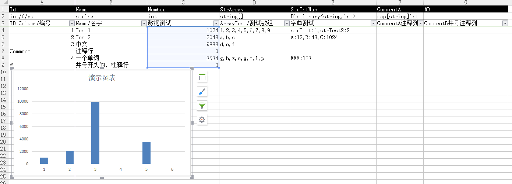

# KFramework

Clean, lightweight, a extensible unity framework

An **official fork** from CosmosEngine: https://github.com/mr-kelly/CosmosEngine
CosmosEngine的官方改名、改进版

# 特点 / Features

* 精简的代码
* 具备完整的策划->美术->程序工作流
* 适用于PC/Android/IOS平台开发
* 高性能，无反射
* 资源模块良好扩展性，支持高清版、低清版
* 良好异步风格AssetBundle加载
* 基于约定的、无配置式的UI模块
* 基于编译的Excel配置表，配置表可添加图标、注释、批注

# 整体结构：模块插拔与三大基础模块

KEngine本质上只是一个模块容器(Module Container)，它只为各个模块提供初始化管理。

打个类比，计划开发一个住宅社区，KEngine是一块没有开垦的满是泥巴的地，资源模块(ResourceModule)就是为这块地铺上了水泥；UI模块就是这个社区的会所，配置表模块就是这个社区的物业公司，它们都以水泥地的铺设为前提。接着各式各样的楼房，就是各个不同的自定义模块了。

框架中存在三大基础模块，是默认初始化的：

* 资源模块 / ResourceModule
* UI模块 / UIModule
* 配置表模块 / SettingsModule

AppEngine.Create函数可以传入继承IModule的类来实现模块添加。一个IModule是通过协程来进行初始化的。

-----------------------
# TODO:快速入门DEMO

# 针对美术人员的模块介绍

_ResourcesBuild_中依次建好产品化所需的目录，如UI、Effect、Audio目录，资源依序放入。

构建系统写入适当的脚本对各个目录进行分别打包。

# 针对策划人员的模块介绍

TODO:Excel的表编辑、编译

# 针对开发人员的模块介绍

# 资源模块 / Resource Module

资源模块可以说是最核心的构成，所有其它模块可以说都会对它进行依赖。
它负责AssetBunbld的打包自动化、异步加载化和统一的资源路径规范管理。

资源模块由3个子模块组成：

* 加载系统(KResourceModule): 用于普遍性的对AssetBundle的加载，通用程度较高
* 打包系统(KResourceBuilder): 基于工程需求的资源打包，比方说针对UI、特效，通过写脚本，分别对应不同的打包策略
* 依赖系统(KAssetDep): U3D官方提供的Push/Pop Dependency以外的另一个选择

## 加载系统 / KResourceModule

资源模块的核心部分，KResourceModule规范了不同平台所不同的打包路径、读取路径、Loader调度等基础部分。已KWWWLoader为基础，提供像AssetBundleLoader, TextureLoader, AssetLoader(GameObject), MaterialLoader等多个加载类，提供Callback和协程两种异步风格方式可选。

## 打包系统 / ResourceBuilder

提供一套可编程的AssetBundle打包器。基于ResourceModule提供的资源路径规范。

默认有KBuildUI类，可自扩充KBuildEffect等根据项目特殊需要进行的打包类。

## 依赖系统 / AssetDep

设计成可选的，用来替换Unity官方AssetBundle依赖机制，也可以用回官方的。

带有一个类似垃圾回收机制的资源释放模式。

加载时主要原理：
* 打包时，对GameObject添加一个用于记录依赖属性的MonoBehavior，并剥离依赖资源。
* GameObject加载完成后，读取依赖属性，加载依赖资源。
* 依赖资源完成后，通知GameObject，把依赖资源设置到指定位置
* GameObject完成加载

### 依赖打包 / DepBuilder
TODO：
### 依赖加载 / AssetDep
TODO:

# UI模块 / UI Module

UI模块，以资源模块为基础，进行UI的编辑、打包、加载。

* 约定优于配置，UI资源与UI脚本严格命名对应
* UI资源Test, 严格对应脚本KUITest.cs

## UI编辑与打包
TODO:

## UI脚本
TODO：

# 配置表模块

* 以Excel为配置表编辑工具, 可为Excel添加表头注释、表格图标
* Excel将被编译成纯文本的Tab表格和C#类，
* 运行端的Tab表格读取，为了性能避开使用Attribute、反射

# 其它模块

* TODO: CosmosTable

# 配置文件/Config

Assets/Resources/KEngineConfig.txt为配置文件，可拖入Excel打开

# Demo

